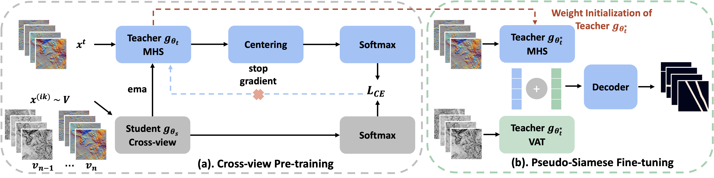
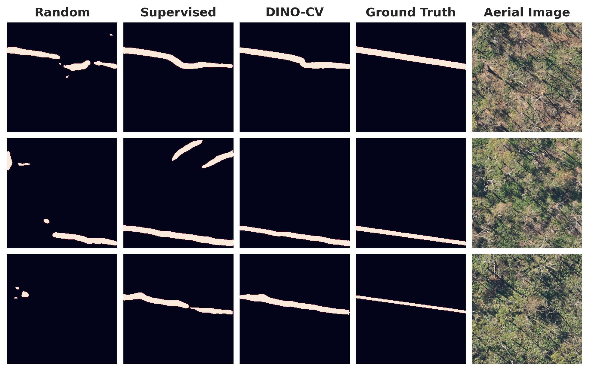

# Self-supervised Pre-training for Mapping of Archaeological Stone Wall in Historic Landscapes Using High-Resolution DEM Derivatives

## Abstract

Dry-stone walls hold significant heritage and environmental value. Mapping and maintaining these structures is essential for preserving ecosystems and supporting wildfire control during dry seasons in Australia. However, a substantial portion of stone walls located in wild landscapes remain unidentified and unregistered due to their inaccessibility and the high cost of mapping. Deep learning-based segmentation models offer a scalable solution for automated mapping of dry-stone walls, but two challenges remain, including (1) visual occlusion of low-lying stone walls by dense vegetation and (2) limited availability of labeled data for training supervised segmentation models. In this study, we propose a segmentation approach for the automatic and accurate mapping of low-lying dry-stone walls using high-resolution digital elevation models (DEMs). The use of Airborne LiDAR-derived DEMs help overcome the visual occlusion problem caused by dense vegetation and canopy cover, by capturing underlying terrain structures that are invisible in traditional optical imagery. Our approach proposes DINO-CV, a self-supervised cross-view pre-training strategy based on knowledge distillation, to address the challenge of limited labeled data. DINO-CV learns invariant visual and structural features across multiple high-resolution DEM derivatives, enabling accurate stone wall mapping on various computer vision backbones (i.e., ResNet, Wide ResNet, and Vision Transformers (ViTs)). Applied to the UNESCO World Heritage cultural landscape of Budj Bim, Victoria, our method successfully identifies one of Australia’s densest collections of colonial dry-stone walls beyond Indigenous cultural heritage. The proposed method achieves a mean Intersection over Union (mIoU) of \textit{68.6}\% between predicted and ground-truth stone wall locations in the test areas, and maintains robust performance of \textit{63.8}\% mIoU when fine-tuned with limited labeled data (10\%) using self-supervised vision backbones pretrained on the DEM derivatives of Budj Bim landscape. These results demonstrate the potential of applying self-supervised learning on high-resolution DEM derivatives for automated mapping of dry-stone walls, particularly in densely vegetated environments and heritage landscapes with limited labeled data.

## Dataset(s)

### Overview

We use two datasets derived from the Budj Bim Cultural Landscape in Victoria, Australia:

| Description         | **BudjBimLandscape** | **BudjBimArea** |
|---------------------|----------------------|-----------------|
| Usage               | Self-supervised pre-training | Supervised fine-tuning and evaluation |
| Coverage Area       | 301&nbsp;km<sup>2</sup>     | 25&nbsp;km<sup>2</sup>               |
| Location            | Budj Bim Cultural Landscape, VIC | Northern Budj Bim region      |
| Data Views          | MHS, VAT             | MHS, VAT, binary wall annotations     |
| DEM Resolution      | 0.5&nbsp;m           | 0.5&nbsp;m                            |
| Tile Size           | 400&nbsp;&times;&nbsp;400 px (resized to 256&nbsp;&times;&nbsp;256) | 400&nbsp;&times;&nbsp;400 px (resized to 256&nbsp;&times;&nbsp;256) |
| Number of Tiles     | 188,006              | 7,102                                 |
| Label Availability  | Unlabeled            | Manual wall annotations               |
| Data Splitting      | Not applicable       | 6-fold leave-one-area-out cross-validation |

### Data Visualizations


*The aerial image (Row 1), Multi-directional Hillshade (MHS, Row 2), and Visualization for Archaeological Topography (VAT, Row 3) of dry-stone walls in the Budj Bim landscape. From left to right, columns show: (1–2) multiple parallel thin walls and an isolated thin wall; (3–4) thick, zigzag walls and a straight wall partially occluded by vegetation; (5–6) roadside straight walls with gate openings, and a heavily occluded wall segment.*

### BudjBimArea Dataset


*Spatial partitioning of the **BudjBimArea** dataset. Orange lines indicate annotated European historic dry-stone walls near Tae Rak (Lake Condah), Victoria, Australia. The number of data samples per area is as follows: Area 1 - 186, Area 2 - 1128, Area 3 - 1138, Area 4 - 1233, Area 5 - 1604, and Area 6 - 1813.*

You can download the **BudjBimArea** dataset, which includes aerial imagery, DEM derivatives (MHS and VAT), and ground-truth annotations of stone wall locations, from the following [Download BudjBimArea dataset](https://mediaflux.researchsoftware.unimelb.edu.au:443/mflux/share.mfjp?_token=sr8E2SfFeMYYvffMD13l1128304699&browser=true&filename=dataset.zip).

## Pretrained Models

### DINO-CV



*Figure: (a) The DINO-CV framework for self-supervised pre-training. At each training iteration *k*, the student network *g<sub>θ<sub>s</sub></sub>* receives a randomly sampled input from the collection of DEM-derived views (i.e., MHS and VAT), while the teacher network *g<sub>θ<sub>t</sub></sub>* receives a fixed view (MHS). (b) The Pseudo Siamese Network used for supervised fine-tuning. This architecture comprises two teacher networks, each pre-trained with DINO-CV on a distinct input view (MHS and VAT), enabling the extraction of complementary features for stone wall mapping.*

### Training DINO-CV

Run the following command lines to pre-train model backbones using DINO-CV. You must change `--data_path` and `--output_dir` as needed. For pre-training WideResNet50 and ViT-small backbones with DINO-CV, please refer to the script `main_dino_cv.sh`.

#### Pre-train ResNet-50 on MHS

```bash
 python3 main_dino_cv_run_with_submitit.py \
 --nodes 1 \
 --ngpus 2 \
 --mem_gb 32 \
 --partition gpu-a100 \
 --time 2-0:0:0 \
 --job_name main_dino_cv \
 --arch resnet50 \
 --use_bn_in_head True \
 --use_fp16 False \
 --lr 0.001 \
 --optimizer sgd \
 --global_crops_scale 0.15 1.0 \
 --min_scale_crops 0.05 \
 --max_scale_crops 0.15 \
 --data_view mhs \
 --data_path ./data/budjbim_landscape \
 --cross_view_training \
 --pretrained \
 --pretrained_model_ckpt ./save/pretrained_weights/dino_resnet50_pretrain.pth \
 --output_dir ./save/pretrained_weights/dino_cv/rn50_mhs_budjbim_pretrained \
 --num_workers 8
```

You can download the pretrained backbones of **ResNet50**, **WideResNet50**, and **ViT-Small-16** trained with DINO-CV on data view of MHS and VAT from the following [Download pretrained backbones](https://mediaflux.researchsoftware.unimelb.edu.au:443/mflux/share.mfjp?_token=GtgfZ4mqUxVNU3QsnIzP1128304701&browser=true&filename=pretrained_weights.zip).

## Supervised Models via Fine-tuning

### Fine-tuning

To fine-tune the **ResNet50** backbone via DINO-CV, run:

```bash
python3 main_segmentation.py --cfg cfg/dino_cv_rn50_budjbim_siamese.yaml --path save/dino_cv_rn50_budjbim_siamese/ --siamese
```

To fine-tune the **WideResNet50** backbone via DINO-CV, run:

```bash
python3 main_segmentation.py --cfg cfg/dino_cv_wrn50_budjbim_siamese.yaml --path save/dino_cv_wrn50_budjbim_siamese/ --siamese
```

To fine-tune the **ViT-Small/16** backbone via DINO-CV, run:

```bash
python3 main_segmentation.py --cfg cfg/dino_cv_vitsmall16_budjbim_siamese.yaml --path save/dino_cv_vitsmall16_budjbim_siamese/ --siamese
```

### Evaluation

To evaluate the **ResNet50** model:

```bash
python3 main_eval.py --cfg cfg/dino_cv_rn50_budjbim_siamese.yaml --path save/dino_cv_rn50_budjbim_siamese/ --siamese
```

To evaluate the **WideResNet50** model:

```bash
python3 main_eval.py --cfg cfg/dino_cv_wrn50_budjbim_siamese.yaml --path save/dino_cv_wrn50_budjbim_siamese/ --siamese
```

To evaluate the **ViT-Small/16** model:

```bash
python3 main_eval.py --cfg cfg/dino_cv_vitsmall16_budjbim_siamese.yaml --path save/dino_cv_vitsmall16_budjbim_siamese/ --siamese
```

## Results Summary

| Method   | Backbone        | Params | F1 Score | mIoU   | Download               |
|----------|----------------|--------|----------|--------|-------------------------|
| DINO-CV  | ResNet-50      | 46M    | 81.2%    | 68.3%  | [model ckpt](https://mediaflux.researchsoftware.unimelb.edu.au:443/mflux/share.mfjp?_token=bAswFj6QlfuFQsZstDts1128304703&browser=true&filename=ft_rn50.zip)    |
| DINO-CV  | ViT-S/16       | 42M    | 80.1%    | 66.8%  | [model ckpt](https://mediaflux.researchsoftware.unimelb.edu.au:443/mflux/share.mfjp?_token=xluIaHuUHRL3F8xaMDbZ1128304707&browser=true&filename=ft_vitsmall16.zip)  |
| DINO-CV  | WideResNet-50-2| 138M   | 81.4%    | 68.6%  | [model ckpt](https://mediaflux.researchsoftware.unimelb.edu.au:443/mflux/share.mfjp?_token=xYmo5kq3w93cPdFPgBL51128304705&browser=true&filename=ft_wrn50.zip)    |

  
*Qualitative results of the ResNet50 backbone fine-tuned via DINO-CV, compared to other methods.*

## Citation

If you find this repository useful, please consider giving a star :star: and citation:

```text
@article{huang2025selfsupervised,
  title     = {Self-supervised Pre-training for Mapping of Archaeological Stone Wall in Historic Landscapes Using High-Resolution DEM Derivatives},
  author    = {Huang, Zexian and Islam, Mashnoon and Armstrong, Brian and Khoshelham, Kourosh and Tomko, Martin},
  journal   = {To appear},
  year      = {2025},
  publisher = {The University of Melbourne},
  note      = {Manuscript in preparation},
  url       = {https://github.com/MLinArcheaomatics/BudjBimStoneWallSeg-SSL}
}
```
